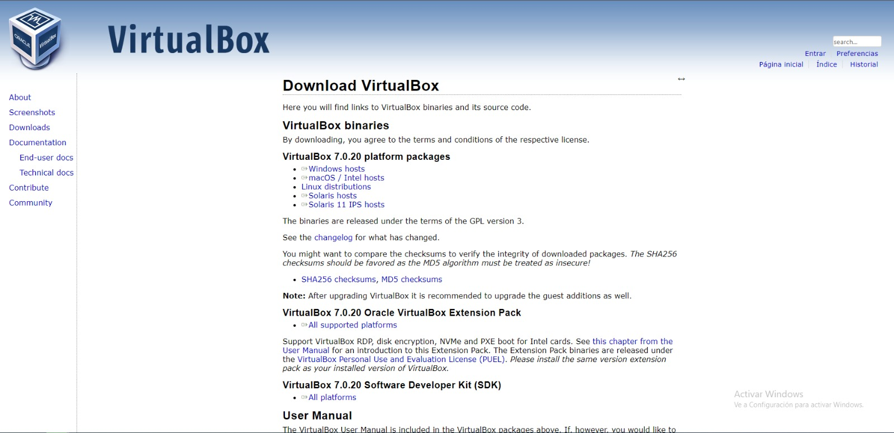
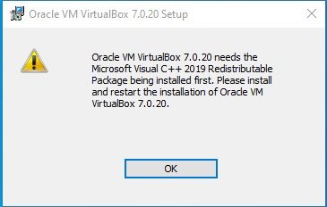
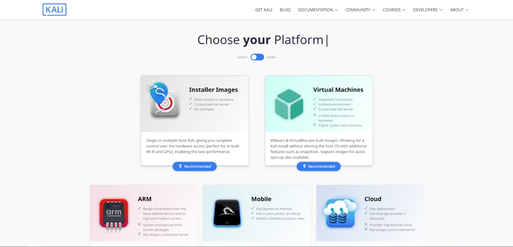
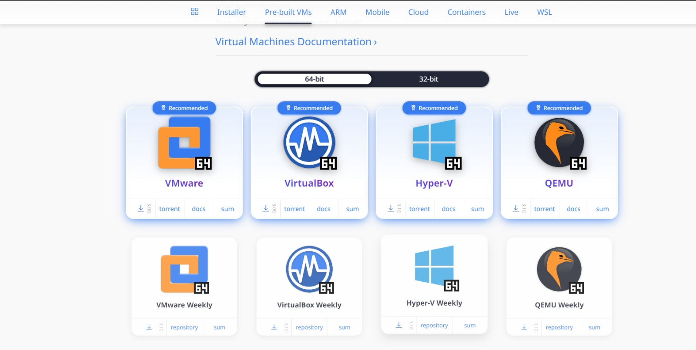
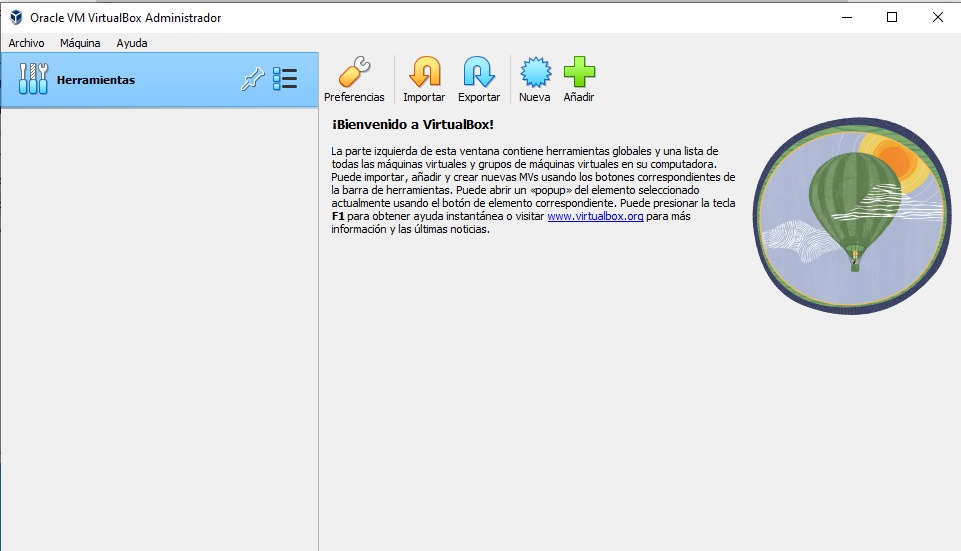
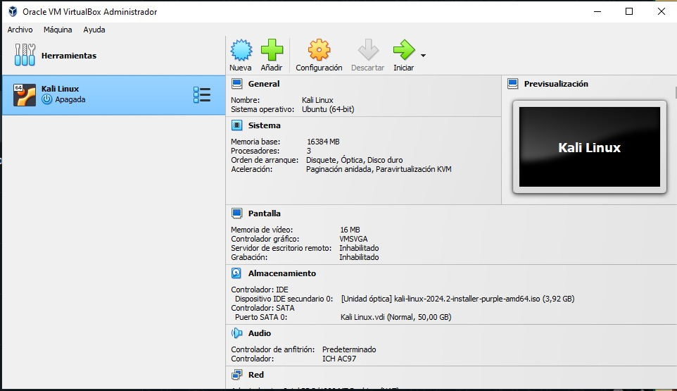

# Creación de Maquina Virtual

Primero, comenzaremos descargando todo lo necesario para poder crear nuestra maquina virtual con Kali Linux.
1. [Descargar Virtual Box](https://www.virtualbox.org/wiki/Downloads)
2. [Descargar Kali Linux](https://www.kali.org/downloads/)

Clickeando en el primer link deberia de aparecer una pagina similar a la siguiente foto, en la cual debemos de elegir el sistema opertaivo en el cual vamos a descargar el programa.

Una vez descargado, si ejecutamos la aplicacion de Virtual Box, puede ser que nos aparezca en mensaje de error (como el de la imgen), en ese caso deberiamos de ir a la pagina de [Microsoft](https://learn.microsoft.com/en-us/cpp/windows/latest-supported-vc-redist?view=msvc-170). En esta pagina, debemos de scrollear un poco para encontrar una tabla como la de la siguiente imagen y seleccionaremos la versión de Visual C++ que necesitamos para nuestro sistema operativo.

___
Clickeando en el segundo link deberia de aparecer una pagina similar a la siguiente foto, en la cual debemos elegir el tipo de instalación que queremos realizar.
Podemos elegir la opción de "Virtual Machines" o "Installer Images". En la opción de "Virtual Machines", te descarga una carpeta con dos archivos, aunque el que nos interesa es el que tiene terminación ".vdi". 
De la misma forma, en la opción de "Installer Images", te descarga un archivo con terminación ".iso". Para este tutorial, elegimos la opción de "Installer Images".

Una vez clickeado en el boton "Download", deberia de aparecer una pagina similar a la siguiente foto, en la cual debemos de elegir el sistema opertaivo en el cual vamos a descargar el programa. Nosotros haremos click en el recuadro de "VirtaulBox", mas precisamente en el boton que tiene el simbolo de "descarga".

___

## Comencemos a configurar nuestra maquina virtual

Apenas iniciemos nuestra aplicacion de virtual box, y deberia de aparecer una ventana similar a la siguiente foto. 

En esta instancia, apretariamos el boton "Nueva" para crear una nueva maquina virtual y se nos desplegaria una ventana similar a la siguiente foto.

<!--Quiero hacer una lista -->
En esta ventana, debemos de elegir: 
1. El nombre que tendra nuestra maquina virtual. Este nombre lo veremos al iniciar nuestra aplicación de Virtual Box. 
2. La carpeta donde se guardar la informacion de nuestra maquina virtual. 
3. Dentro de "Imagen ISO", debemos de elegir el archivo que hemos descargado anteriormente. (el ".iso") 

Después de haber completado esos campos, le daremos al boton de "Siguiente" para seguir configurando nuesta maquina virtual.

En esta ventana, configuraremos la memoria ram y la cantidad de procesadores que queremos asignar a nuestra maquina virtual. De esto depende la velocidad de nuestro sistema operativo, por lo que es importante elegir la cantidad adecuada para nuestro sistema operativo, aunque después de tener configurado nuestra maquina, tambien podremos cambiar esta parte de la configuración 
Una vez tengamos todo listo, le daremos al boton de "Siguiente" para seguir configurando nuesta maquina virtual.

En esta ventana, configuraremos la cantidad de espacio en el disco duro que queremos asignarle a nuestra maquina virtual. Esto va a depender mucho del ususario, ya que depende de la cantidad de datos que queremos guardar en nuestra maquina virtual. 
Una vez tengamos todo listo, le daremos al boton de "Siguiente" para seguir configurando nuesta maquina virtual.

Esta es la ultima ventana que tendremos antes de tener nuestra maquina lista y sirve para ver los valores que hemos configurado. Si todo ha ido bien, le daremos al boton de "Terminar" para crear nuestra maquina virtual.
___

## Configurando Kali Linux

Una vez creada nuestra maquina virtual, debemos de entrar a ella para poder configurar su sistema. Para ello, debemos de hacer click en el boton "Iniciar" de la maquina virtual que hemos creado. Una vez dentro de nuestra maquina virtual, deberia de aparecer una ventana similar a la siguiente foto. 
NOTA: En esta sección solo podremos navegar entre las diferentes opciones con las flecha de nuestro teclado y para seleccionar una opción, debemos de presionar "Enter". 

Una vez dentro de nuestra maquina virtual, tendremos para elegir entre distintas opciones para configurar nuestro sistema operativo. 
Por defecto, vendra marcada la primera opción, pero nosotros queremos seleccionar "Start Installer".

<!-- Reemplazar esta imagen por una que no tenga lo de "Autocapturar teclado"-->

Aqui, escogemos el idioma que queremos que nuestro sistema use, en este caso, elegimos Español.

Aqui, escogemos la ubicación donde queremos que nuestro sistema use, en este caso, elegimos "Uruguay".

Aqui, escogemos el teclado que queremos que nuestro sistema use, en este caso, elegimos "LatinoAmericano".

Aqui, escogemos el nombre que queremos que nuestro sistema use, en este caso, elegimos "kali".

Aqui, escogemos el nombre de dominio que queremos que nuestro sistema use, en este caso, elegimos "Kali".

Aqui, escogemos el nombre de usuario que queremos que nuestro sistema use, en este caso, elegimos "k4l1".

Aqui, escogemos la contraseña que queremos que nuestro sistema use. Recuerde guardar esta contraseña, ya que la necesitaremos para acceder a nuestra maquina virtual.

Aqui, simplemente escogeremos la opción 1 "Guiado - utilizar todo el disco", ya que es la forma sencilla de hacerlo.

Aqui escogeremos el disco que querramos utilizar para guardar la información. En mi caso, al solo tener un disco, solo tengo una opción, pero depende de cada maquina y donde el usuario quiera guardar la información. 
**NOTA:** Lo que dice acerca de que se borrara la información, solo sucede en caso de que el sistema se este instalando como sistema principal, pero en nuestro caso que estamos instalando como una maquina virtual, no se borrará la información.

Aqui escogeremos la primera opción ya que es la recomendada para novatos. El resto de la opciones son opciones avanzadas.

Aqui escogeremos la opción de "Finalizar el particionado (...)", para poder continuar con la configuración del sistema.

Cuando aparezca esta foto, seleccionarmeos la opción "Si" para que se escriban las opciones de configuración que fuimos seleccionando en el correr de esta configuración.

Aqui le daremos a la opción "Si" para que se instalen los paquetes que necesitamos para nuestro sistema operativo.

En esta pantalla, deajremos el espacio en blanco y simplemente le daremos a "Enter", ya que no contamos con la información que se nos pide.

Aqui le daremos a la opción "Si" para que se instale el cargador de sistema.

En esta pantalla selecionaremos el disco que anteriormente configuramos, para que el sistema arranque desde alli.

Finalmente, le daremos a la opción "Si" para que se instale el sistema operativo. La maquina debera reiniciarse para que el sistema quede correctamente instalado.

___

## Instalando Docker

___

## Instalando ZAP

___

